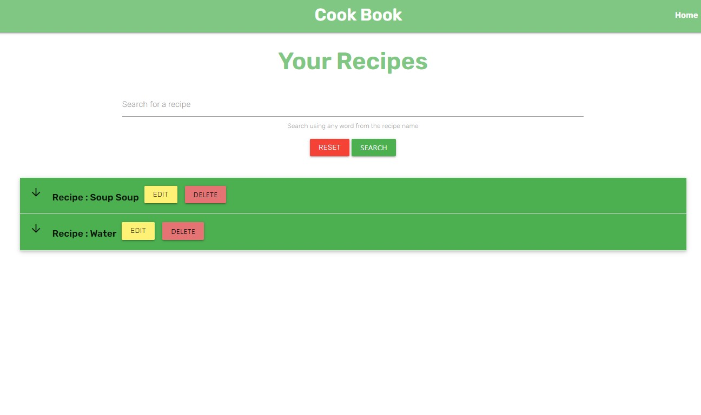
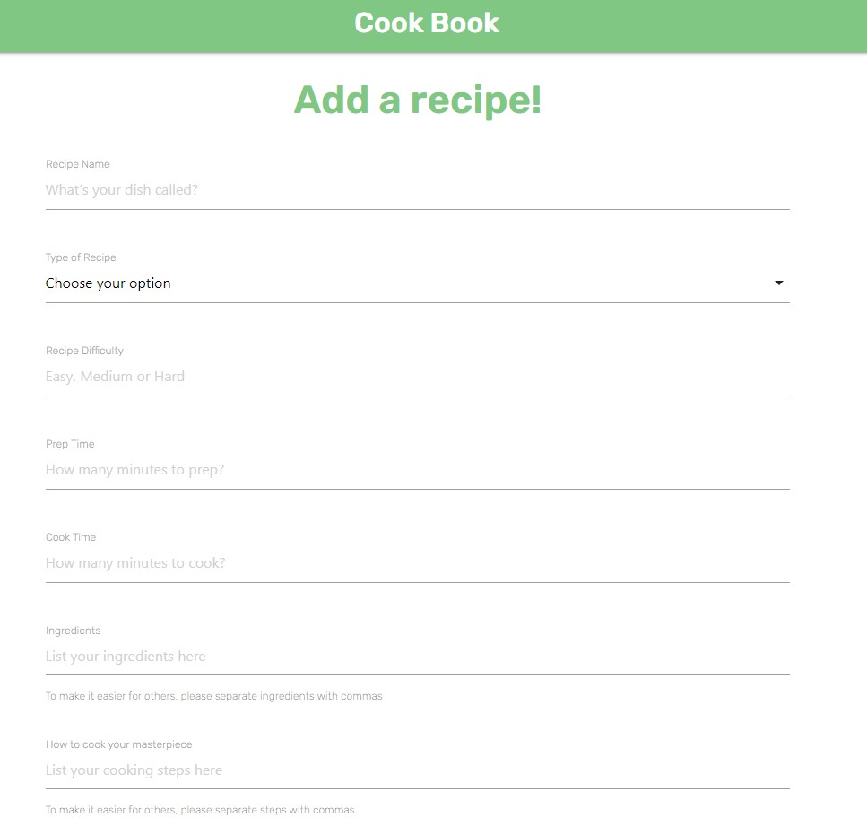
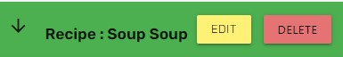
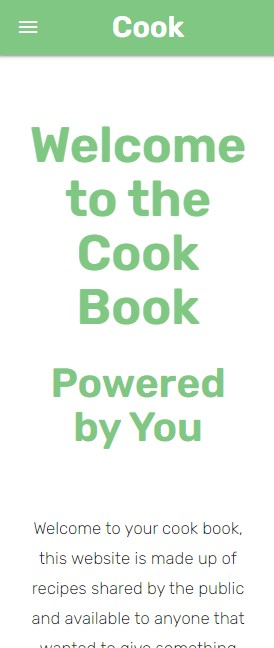
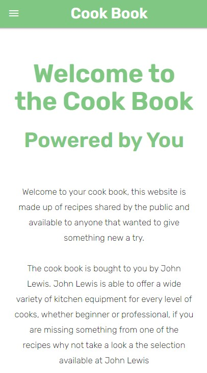
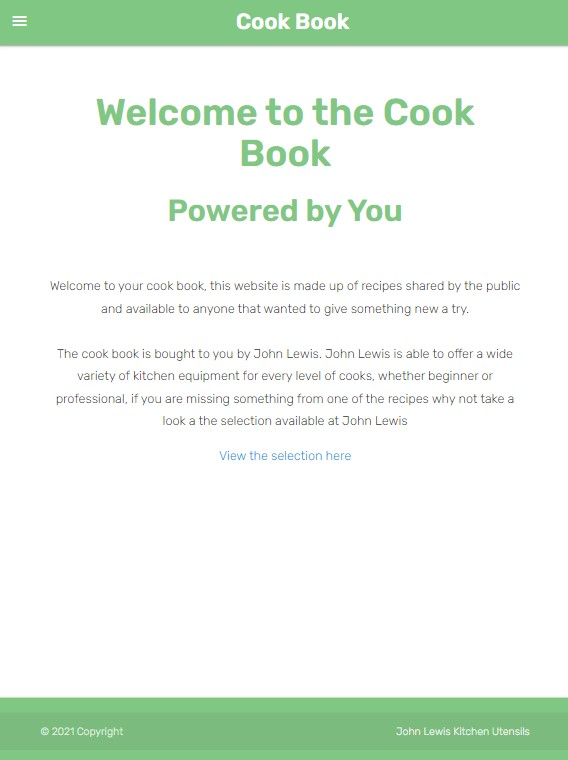

Please note this page is not sponsered or affilated with John Lewis in any way, this is just a personal project

REMEMBER TO TURN DEBUG TO FALSE IN APP.PY BEFORE SUBMISSION 

first recipe https://www.bbcgoodfood.com/recipes/chorizo-mozzarella-gnocchi-bake

string to array https://appdividend.com/2020/09/25/how-to-convert-python-string-to-array/#:~:text=To%20convert%20String%20to%20array,elements%20as%20individual%20list%20items.

# Cook Book - A place to find and share recipes

This project is designed to be place where users can come to find recipes or share recipes that they want the world to see. The project is linked with selling kitchen utensils and by including a link on the recipe page where utensils are shared it helps with brand recognition and potential sales. (in this case the brand is John Lewis, there is no official allifiation with the company)

## UX

It has been design to be simple and nice on the eyes and easy to use, the pages use a white and green colour scheme throughout and easy navigation using a navbar on the top of the page (sidebar for smaller devices)

## Wireframes

Wireframes were designed using Miro, they can be found here
[Wireframes](https://miro.com/app/board/o9J_lELdMyA=/)

## User Stories

1. As a user I want to be able to find recipes to cook, preferably with a search function to find a recipe name

2. As a user I want to be able to add a recipe to the website

3. As a user I want to be able to edit or delete recipes that I have added

4. As a user I want to be able to use the website on multiple devices of verying sizes

5. As a site owner I want to be able to promote a brand using links to specific sponsers

## Existing Features

- Recipe list that anyone can view whether signed in or not
- Register/Login/Logout functionality
- CRUD functionality for users that are logged in
- Simple UI design, easy to read, not distracting from purpose

## Future Features

- Further search functionality, currently only available via recipe name
- Tags to recipes so groups of recipes can be formed
- Nutritional information such as calories and allergins

## Tech Used

- [Materialize](https://materializecss.com/)
- **Materialize** is used to give the pages a uniform layout using the grid feature, Components are used to add additional features such as modal and collapsibles.

- [JQuery](https://jquery.com)
- The project uses **JQuery** as part of Materialize components

- [GoogleFonts](https://fonts.google.com/)
- The project uses **GoogleFonts** to provide the fonts used on the pages

## User Story Testing

1. As a user I want to be able to find recipes to cook, preferably with a search function to find a recipe name
    1. The recipes page is clear with a search function at the top to make finding recipes easy

    

2. As a user I want to be able to add a recipe to the website
    1. Using the add recipe page, any user that is registered and logged in can easily add a recipe using the form

    

3. As a user I want to be able to edit or delete recipes that I have added
    1. All recipes added by a user will have an edit and delete button by their titles for simple editing or deleting by that user only

    

    2. When not logged or a different user views recipes the buttons are not visible

    

4. As a user I want to be able to use the website on multiple devices of verying sizes
    1. Responsive design means users can use main different screens and resolutions and still have full functionality

    

    

    

5. As a site owner I want to be able to promote a brand using links to specific sponsers
    1. Sponsers can be plugged using links on the home page, within the footer and also when viewing recipes under the equipment needed section

    

    
## Feature Testing

| Feature | Action taken  | Expected result | Pass/Fail |
| :--- | :--- | :--- | :--- |    
|  |  |  |  |
|  |  |  |  |
|  |  |  |  |
|  |  |  |  |
|  |  |  |  |
|  |  |  |  |
|  |  |  |  |
|  |  |  |  |
|  |  |  |  |

## Bugs

## Deployment

The project has been deployed using Heroku

1. Login to Heroku
2. 

### Acknowledgements

- A few acknowledgements here that I would have been stuck without;

- the method to convert strings to array was found here - https://appdividend.com/2020/09/25/how-to-convert-python-string-to-array/#:~:text=To%20convert%20String%20to%20array,elements%20as%20individual%20list%20items

- recipes that were used throughout development were found using - https://www.bbcgoodfood.com/recipes/

-Code Institute, Tutors and my Mentor were all a big part of making this project possible
